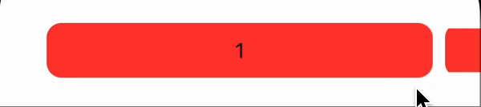

# Horizontal Pager View

[](https://opensource.org/licenses/MIT)

`HorizontalPagerView` provides a paging component built with SwiftUI native components. Pager is a view that renders a scrollable container to display multiple items paginated.

This is an improved version of a solution posted by [mecid](https://gist.github.com/mecid) on [gist](https://gist.github.com/mecid/e0d4d6652ccc8b5737449a01ee8cbc6f).

### Table of Contents  
- [Requirements](#requirements)  
- [Showcase](#showcase)
- [Usage](#usage)
- [License](#license)

## Requirements

- iOS 15.0+ (it might work on older versions)
- Swift 5.0+

## Showcase



## Usage

### Initialization

Creating a `HorizontalPagerView` can be done easy by providing only 3 parameters:
- `items` which is an array of Hashable & Equatable conforming entities
- `selectedItem` which is the centered item
- `contentBuilder` which is a `@escaping` `ViewBuilder` which takes an item and builds its view

```swift
HorizontalPagerView(
    items: items,
    selectedItem: $selectedCard
) { item in
    Text(item.name)
      .frame(maxWidth: .infinity)
      .padding(.horizontal, 16)
      .padding(.vertical, 12)
      .background(.red)
      .scaleEffect(y: selectedCard.id == item.id ? 1.0 : 0.8)
      .cornerRadius(12)
}
```

### UI Customization

`HorizontalPagerView` is currently limiting the size of the displayed item at 80% (0.8) of the available width. This will be updated later in order to let it be set from outside.

In addition to that, the space between 2 cards will be customizable in future.

## License

`HorizontalPagerView` is available under the MIT license. See the [LICENSE](License) file for more info.